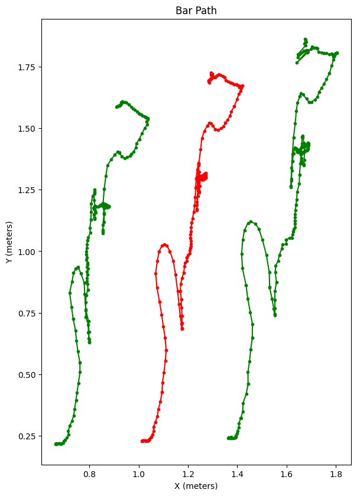

# bar_tracking
WIP AI barbell tracking, using pytorch and a CNN

## Current Progress
### Test video with tracked plate centers and average  

### X-Y Position Plot
This shows that the tracking can be very accurate. The units have been scaled automatically based on the size of the plates from the video.  
