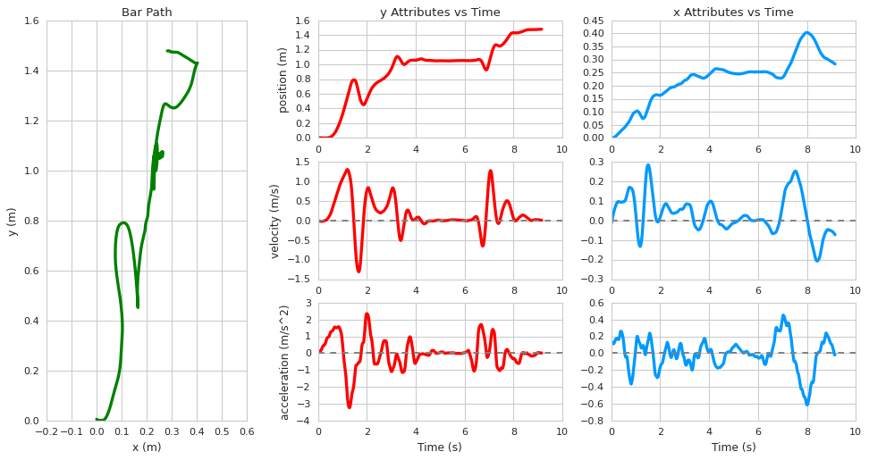

# bar_tracking
WIP Python Deep Learning Barbell Tracking  

To install:
```
pip install git+https://github.com/cluffa/bar_tracking
```

main script: <https://github.com/cluffa/bar_tracking/blob/main/BarTracking/track.py>

I created this model and python package to be able to track a barbell and get different metrics. It works using a choice of convolutional neural networks with 2-5 million parameters. This takes a 320x320x3 matrix input and outputs a segmentation of the image (aka mask). Ellipses are fit to the largest inside and outside weight plates detected in the mask. This is a reliable way find the center, even if the object is partially out of frame. The average of the two sides is used for the metrics. This is a good way to combat some of the distortions due to off-axis movements like rotation. The plates are always a constant 450 mm, so I was able to scale the units from pixels to meters using the dimensions of the ellipses. The position at every time is then used to create two splines, f1(t)=x and f2(t)=y. The velocity and acceleration are derived from the splines. These also go through Savgov filters remove distortions and noise.

## Current Progress
### Test video  


### Plot   


### Datafame output  
```
       t      x_in     x_out      y_in     y_out  height_in  height_out  width_in  width_out         x         y        vx        vy        ax        ay
0  0.000  0.624343  1.329472  1.802204  1.785655   0.419158    0.482481  0.472880   0.503475  0.002938  0.024106 -0.053835 -0.145602  0.672035  0.335851
1  0.025  0.623141  1.327983  1.804415  1.790724   0.419977    0.481908  0.472300   0.506429  0.001592  0.020466 -0.037034 -0.137206  0.642039  0.378422
2  0.050  0.622380  1.326892  1.806544  1.795455   0.420708    0.481425  0.471649   0.509103  0.000667  0.017035 -0.020983 -0.127745  0.612042  0.420992
3  0.075  0.622040  1.326183  1.808562  1.799825   0.421355    0.481027  0.470932   0.511509  0.000142  0.013842 -0.005682 -0.117220  0.582046  0.463563
4  0.100  0.622101  1.325837  1.810440  1.803807   0.421920    0.480709  0.470151   0.513655  0.000000  0.010911  0.008870 -0.105631  0.552050  0.506134
```
Columns:  
variable name | description
--- | --- |
t                    | time in seconds
x_in, y_in| position of the inside ellipse
x_out, y_out| position of the outside ellipse
height_in, width_in|dimensions of the inside ellipse
height_out, width_out| dimensions of the outside ellipse
x, y| mean position of the ellipses
vx, vy| velocity
ax, ay| acceleration
